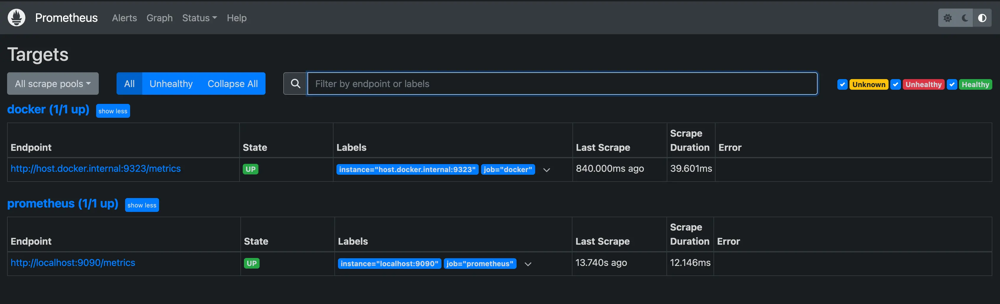

1 - Install prometheus using docker by
`docker run -p 9090:9090 prom/prometheus`

2 - Create a prometheus.yml file in the folder.

```global:
scrape_interval: 30s
evaluation_interval: 25s

scrape_configs:

- job_name: "prometheus"
  static_configs:
  - targets: ["localhost:9090"]`
```

3 - Bind-mount your prometheus.yml from the host by running:

```
docker run \
    -p 9090:9090 \
    -v ./prometheus.yml:/etc/prometheus/prometheus.yml \
    prom/prometheus
```

4 - Create a persistent volume
`docker volume create prometheus-volume`

5 - Run Prometheus

```
docker run --rm --detach \
    --name my-prometheus \
    --publish 9090:9090 \
    --volume prometheus-volume:/prometheus \
    --volume "$(pwd)"/prometheus.yml:/etc/prometheus/prometheus.yml \
    prom/prometheus
```

Here's what the command does:

- Spin up an instance of the prom/prometheus Docker container image in detached mode (so you can continue using your terminal session).
- The --rm flag tells Docker to delete the stopped image when you finish working with it. This is only suitable for development/testing purposes and helps you automatically clean up containers that you're no longer using.
- The first --volume command tells Prometheus to store its metrics data in the Docker persistent volume we created earlier.
- The second --volume command passes in our Prometheus configuration file by placing it in the container's file system so that Prometheus uses it when it starts up.
- The --publish command exposes the container port 9090 to our local machine so that we can access Prometheus in a web browser.

6 - Check if it's running: [http://localhost:9090](http://localhost:9090)

7 - Shutting down and free up the port: `docker kill my-prometheus`

8 - We need to set up docker to expose its metrics. For this, we need to go to /etc/docker/daemon.json and add the following:

```
{
  "metrics-addr": "0.0.0.0:9323"
}
```

This way, we are exposing the port 9323 of the host, to the prometheus container.

9 - Next we need to change the prometheus.yml to be able to see this metrics path. So, the file will be like this:

```
global:
  scrape_interval: 30s
  evaluation_interval: 25s

scrape_configs:
  - job_name: prometheus
    static_configs:
      - targets: ["localhost:9090"]

  - job_name: docker
    static_configs:
      - targets: ["host.docker.internal:9323"]
```

We added the host.docker.internal to be accessible from the prometheus container.

10 - Now we can run the container again, passing the host as parameter to make sure that the host's internal IP gets exposed to the prometheus container.

```
docker run --rm --detach \
    --name my-prometheus \
    --publish 9090:9090 \
    --volume prometheus-volume:/prometheus \
    --volume "$(pwd)"/prometheus.yml:/etc/prometheus/prometheus.yml \
    --add-host host.docker.internal:host-gateway \
    prom/prometheus
```

11 - Open the prometheus dashboard to check if the target is listed: [http://localhost:9090/targets/](http://localhost:9090/targets/)


